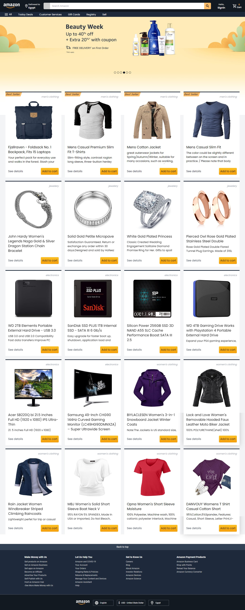

<h1>Amazon Clone with ReactJS</h1>

This project is a clone of the popular e-commerce website Amazon. It has been built using ReactJS, Redux Toolkit for state management, Firebase for authentication, and TailwindCSS for styling.

<h3>Features:</h3>

<li>User authentication using Firebase.
<li>Browse and search for products.
<li>Add products to your cart.
<li>Responsive and modern UI with Tailwind CSS.
<li>Material Icons integrated.

 <h3>You can visit <a href="https://amazon-clone-psi-flame.vercel.app/" target="_blank">Amazon CLone.</a>
  

</h3>
